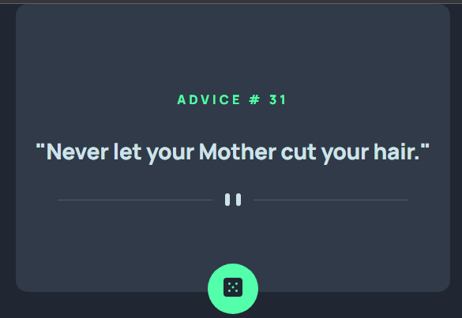
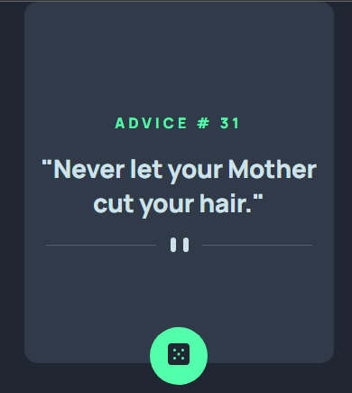

# Advice Generator [September 30th 2022]

This project is one of the junior Javascrpit challenges from [Frontend Mentor](https://www.frontendmentor.io/).

## Table of contents

- [Overview](#overview)
  - [Screenshot](#screenshot)
  - [Links](#links)
  - [Features](#features)
- [My process](#my-process)
  - [Built with](#built-with)
  - [What I learned](#what-i-learned)
  - [Continued development](#continued-development)
  - [Useful resources](#useful-resources)
- [Author](#author)
- [Acknowledgments](#acknowledgments)

## Overview

In this project, the goal was to reach out to an API and generate data with each click of the button. This project was very fun and it generates valuable advice 😃

### Screenshots

### Links

- Live Site URL: [Advice Generator](https://classy-scone-30f3d2.netlify.app/)

### Features

- Generates advice with every click of the button
- Displays the index of the advice from the API
- Responsive Layout for mobile functionality

## My process

I started by looking at figma files and writing down the possible routes I can take in terms of setting up my files. I then strctured my HTML file, then i used the figma file to get the appropriate colors and sizing to set up my CSS file.

### Built with

- HTML
- CSS
- Javascript

### What I learned

This project was really fun to do. I got achace to untilize the [Advice Slip API](https://api.adviceslip.com/) and practice fetching data from an API which is one my favorite things to do.

### Continued development

In the future, i would like to add a copy to clipboard button.

### Useful resources

- [Frontend Mentor](https://www.frontendmentor.io/).

## Author

- Jaron Denzel Young

## Acknowledgments

Thank you, Frontend Mentor, for being an awesome place to learn.
